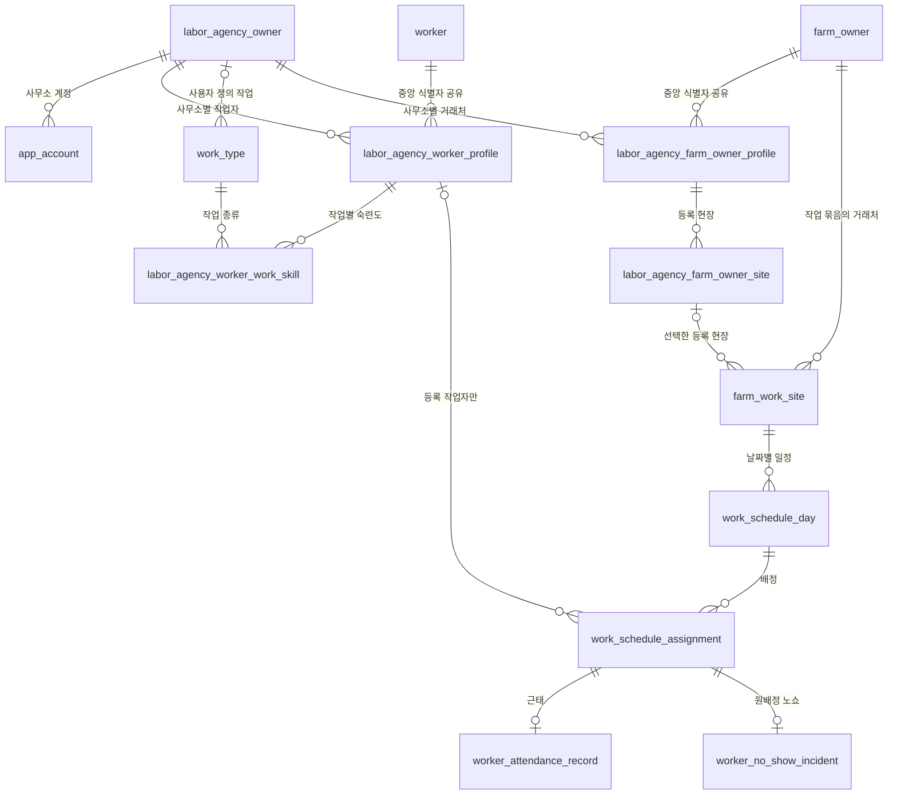

# LaborFlow 데이터베이스 구조

이 문서는 LaborFlow의 **현재 구현 스냅샷**이다. 최종 설계나 설계 승인 문서가 아니며, 이후 구현 에이전트는 이 문서보다 최신 사용자 결정과 실제 코드·마이그레이션을 먼저 확인해야 한다.

## 조사 기준

- 기준일: 2026-09-13 (Asia/Seoul과 같은 UTC+9 업무 환경을 전제로 소스 해석)
- 브랜치: `dev`
- 구현 시작 기준 커밋: `4970ccebd7aba17b7c3943ed4d067f64f7190a75`
- 작업 상태: 위 커밋에서 시작한 현재 일지 구현과 마이그레이션을 반영했으며 운영 DB 적용 여부는 확인하지 않음
- 스키마 기준: `database/migrations/001_...sql`부터 `034_...sql`까지 순서대로 적용한 최종 상태
- 애플리케이션 기준: backend-core의 Service, DAO, 트랜잭션 선언과 기존 API 문서 대조
- 운영 DB 확인: 수행하지 않음. `flyway_schema_history`, 실제 테이블·인덱스·데이터는 조회하지 않았다.

## 문서 구성

- [최종 스키마](schema.md): 41개 테이블의 역할, 컬럼, 제약, 인덱스, 읽기·쓰기 코드
- [관계와 업무 흐름](relationships-and-flows.md): Mermaid 관계도와 등록·일정·배정·근태·노쇼 흐름
- [데이터 경계와 확인 사항](boundaries-and-gaps.md): 삭제, 이력, 개인정보, 사무소 범위, 구현 불일치와 후속 질문
- [마이그레이션 운영 안내](../../database/README.md): Flyway 패키징과 적용 방법
- [API 계약](../api/README.md): 요청·응답 및 화면 계약

## 상태 표기

| 표기 | 의미 |
|---|---|
| **사용 중** | 현재 Service/DAO 또는 DB 트리거에서 읽기·쓰기가 확인됨 |
| **DB 기반** | 테이블과 제약은 있으나 현재 사용자 API 연결이 확인되지 않음 |
| **계획** | 기존 정책·API 문서에만 있으며 현재 DB/API 구현으로 확인되지 않음 |
| **확인 필요** | 구현과 문서가 다르거나 운영 상태·보장 범위를 소스만으로 확정할 수 없음 |

## 전체 개요

실선 관계는 실제 FK다. `farm_work_site.client_work_site_uuid`와 등록 작업자 배정의 `worker_profile_uuid`는 nullable이라 선택 관계다. 익명 참여자는 `work_schedule_assignment.worker_profile_uuid`가 null이며, 별도의 중앙 `worker`를 만들지 않는다.

## 가장 중요한 관계

1. `worker`는 중앙 작업자 식별자이고, 사무소가 입력한 이름·호칭·전화·메모·승차장소는 `labor_agency_worker_profile`에 분리된다. 한 `worker`에 여러 사무소 프로필이 연결될 수 있다.
2. `farm_owner`와 `labor_agency_farm_owner_profile`도 같은 중앙/사무소 구조다. 거래처가 반복 사용하는 현장은 `labor_agency_farm_owner_site`, 실제 작업 묶음은 `farm_work_site`다.
3. 여러 날짜 일정은 `farm_work_site` 하나와 날짜별 `work_schedule_day` 여러 행으로 표현한다. 배정은 특정 `work_schedule_day`에 연결된다.
4. 등록 작업자와 익명 참여자는 모두 `work_schedule_assignment`에 저장한다. `participant_type`과 nullable `worker_profile_uuid`가 둘을 구분하고, 익명 인원 묶음은 같은 `participant_group_uuid`를 공유한다.
5. 근태는 배정당 활성 `worker_attendance_record` 최대 한 건이며, 변경 시 DB 트리거가 `worker_attendance_revision`을 만든다. 일정 단위 메모도 별도 요약·리비전 테이블에 보존한다.
6. 노쇼는 원배정을 `REPLACED`, 근태를 `ABSENT`로 바꾸면서 `worker_no_show_incident`와 명시적 리비전을 남긴다. 취소를 위해 원상태 스냅샷을 보관한다.
7. 동시 배치 주의는 사무소 프로필 UUID 두 개를 정렬해 한 쌍으로 저장한다. 충돌을 확인하고 저장하면 `worker_separation_override_audit`이 남는다.

## 갱신 기준

다음 중 하나가 바뀌면 이 문서 묶음을 함께 갱신한다.

- 새 migration 추가 또는 기존 migration의 기준선 변경
- DAO가 읽거나 쓰는 테이블, 소프트 삭제 범위, 트랜잭션·잠금 방식 변경
- 중앙 식별자와 사무소별 프로필의 병합·노출 정책 변경
- 일정 묶음/날짜별 일정/배정/근태/노쇼 상태 전이 변경
- `_encrypted` 필드의 실제 암호화 계층 도입
- 로그인 식별자 전달 방식이 인증된 principal 기반으로 전환
