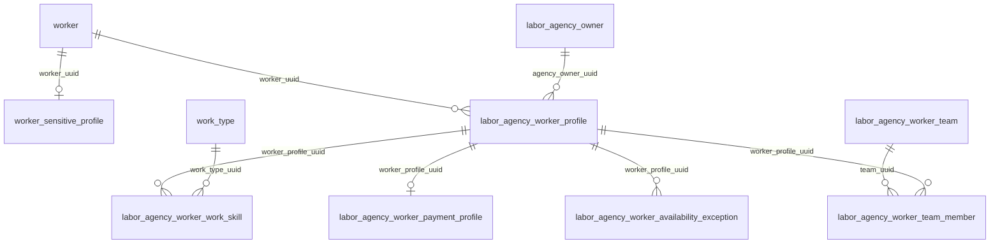
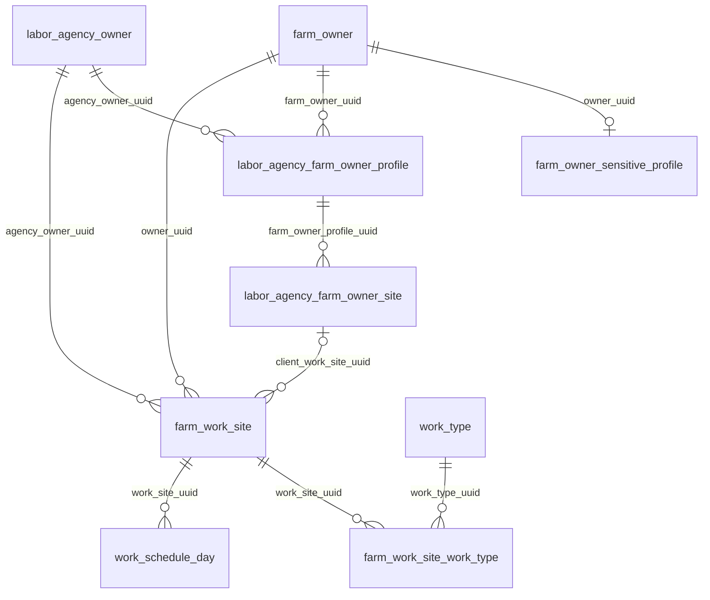
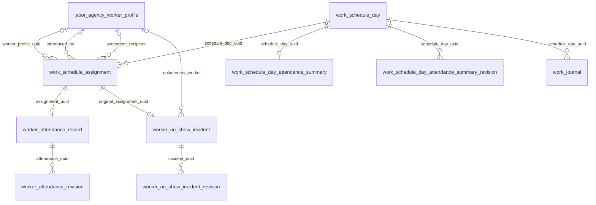
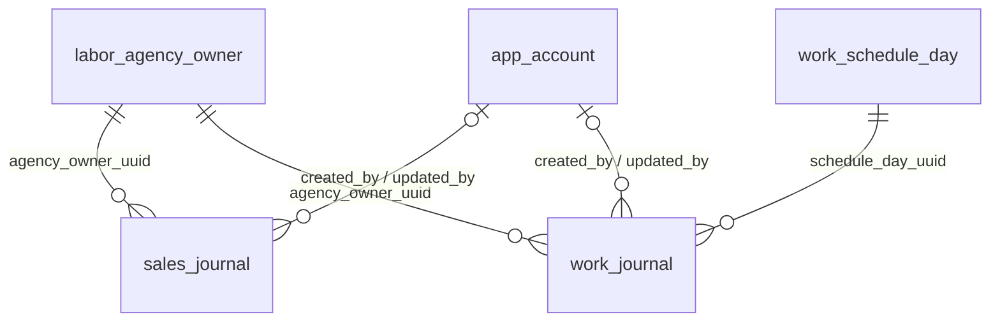
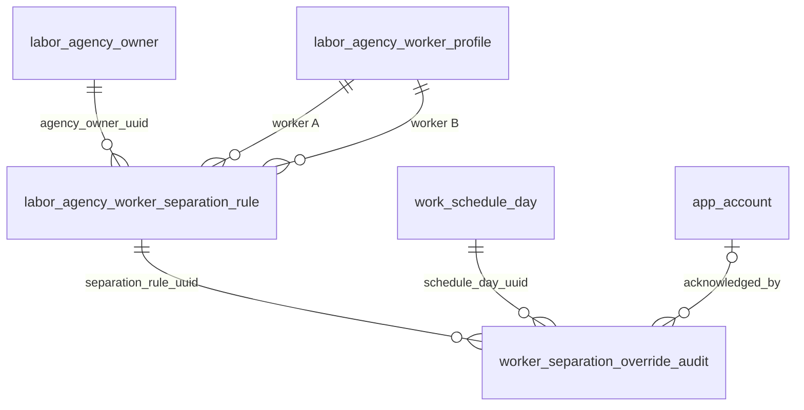

# 관계와 업무 흐름

[DB 문서 홈](README.md) · [최종 스키마](schema.md) · [경계와 확인 사항](boundaries-and-gaps.md)

## 관계도 읽는 법

- Mermaid 선은 실제 FK만 표현한다.
- `||`는 반드시 하나, `o|`는 0 또는 1, `o{`는 0개 이상이다.
- FK가 없고 코드나 값으로만 연결되는 관계는 그림 아래에 **논리적 관계**로 따로 적는다.
- 소프트 삭제 행도 물리적으로는 관계에 남는다. 아래 선택성은 활성 행만을 보장하지 않는다.

## 중앙 작업자와 사무소별 프로필

- 전화 hash가 중앙 `worker_sensitive_profile`에 이미 있으면 작업자 등록 코드는 새 `worker`를 만들지 않고 현재 사무소의 `labor_agency_worker_profile`만 만든다.
- 중앙 전화 hash는 non-null일 때 전역 UQ이고, 사무소 전화 hash는 활성 프로필에 한해 사무소 안에서 UQ다.
- 한 중앙 worker는 여러 사무소 프로필을 가질 수 있다. 현재 화면/DAO는 로그인 ID에 연결된 `agency_owner_uuid`의 프로필만 조회한다.
- 팀원은 활성 상태에서 한 팀에만 속할 수 있다. 팀 변경 시 DAO가 이전 팀원을 비활성·소프트 삭제하고 새 팀 연결을 활성화한다.

## 거래처, 등록 현장, 일정 묶음

- `labor_agency_farm_owner_site`는 거래처 상세에서 관리하는 반복 사용 현장 마스터다.
- `farm_work_site`는 이름과 달리 작업내용·거래처·기간·기본 시간/인원 등을 묶는 일정 그룹이다.
- `farm_work_site.client_work_site_uuid`는 nullable이다. 기존 현장을 선택한 일정은 FK로 연결되고, 자유 입력 일정도 생성 가능하다.
- 일정 저장 중 자유 입력한 현장은 `ClientsService.resolveWorkSite`를 통해 거래처 현장 마스터로 해석·생성된 뒤 작업 묶음에 연결된다.
- 한 묶음의 날짜별 시간·필요 인원·메모는 `work_schedule_day`에 따로 저장된다. 작업내용, 거래처, 현장, 작업 종류는 묶음 단위다.

## 배정, 근태, 노쇼

- 등록 작업자는 `participant_type='REGISTERED'`이고 `worker_profile_uuid`가 필수다.
- 익명 참여자는 `participant_type='GUEST'`이고 `worker_profile_uuid`가 반드시 null이다. 여러 사람을 한 토큰처럼 표시할 때 물리 행들은 `participant_group_uuid`를 공유한다.
- `worker_count`는 남아 있지만 등록 작업자는 migration `027`에서 1로 정규화됐다. 기존 추가 인원은 소개자·정산 수령자를 원 등록 작업자로 둔 guest 행으로 전환됐다.
- 근태는 활성 assignment당 최대 한 행이다. guest 근태의 `worker_profile_uuid`는 null일 수 있다.
- 노쇼 incident는 원배정과 0 또는 1개의 현재 대체 배정을 가리킨다. 원배정당 활성 incident도 최대 하나다.
- 작업일지는 날짜별 `work_schedule_day`에 연결된다. 활성 일지는 최대 하나이며 일정·배정·근태 값을 복사하지 않고 조회 시 현재 원본을 조합한다.

## 영업일지와 작업일지

- `sales_journal`은 거래처 FK가 없는 의도적인 자유 기록이다. 한 본문에 여러 지역·거래처가 함께 등장할 수 있다.
- `work_journal`은 다일 묶음 `farm_work_site`가 아니라 날짜별 `work_schedule_day`에 연결되어 다른 날짜의 메모가 섞이지 않는다.
- 활성 일지의 1:1은 부분 UQ로 보장되며 소프트 삭제 후 같은 작업에 새 활성 일지를 만들 수 있다.

## 동시 배치 주의

- A/B 방향이 다른 중복을 막기 위해 작은 UUID를 `worker_profile_uuid_a`, 큰 UUID를 `worker_profile_uuid_b`에 저장한다.
- 두 profile FK에 `agency_owner_uuid`가 함께 들어가므로 한 규칙의 두 작업자는 같은 사무소 프로필이어야 한다.
- 배정 저장 시 `ScheduleService.updateTask`가 동일 날짜·현장 범위의 관련 작업자를 비교한다.
- DAO는 `pg_advisory_xact_lock(hashtextextended(lockKey, 0))`로 해당 사무소·날짜·현장 범위를 트랜잭션 동안 직렬화한다.
- 미확인 규칙이 있으면 409 충돌을 반환한다. 사용자가 규칙 UUID를 확인 목록으로 다시 보내 저장하면 같은 트랜잭션에서 override audit을 추가한다.

## 업무 흐름

### 거래처와 현장 등록

1. `ClientsService.createClient`가 전화 등 입력을 정규화한다.
2. 중앙 전화 hash가 일치하면 기존 `farm_owner`를 재사용하고, 아니면 중앙 row와 필요 시 `farm_owner_sensitive_profile`을 만든다.
3. 현재 사무소의 `labor_agency_farm_owner_profile`을 생성한다. 다른 사무소의 local 정보는 복사하지 않는다.
4. 입력한 현장마다 `labor_agency_farm_owner_site`를 저장한다. 수정은 `replaceClientWorkSites` 방식으로 현재 목록과 맞추며 제거된 현장은 소프트 삭제한다.
5. 전체 쓰기는 `ClientsService`의 `@Transactional` 범위다.

### 여러 날짜 일정 생성과 수정

1. 일정 생성은 `farm_work_site` 한 행을 만든다.
2. 시작일부터 종료일까지 날짜별 `work_schedule_day`를 만든다.
3. 작업 종류는 `farm_work_site_work_type`에 묶음 단위로 연결한다.
4. 범위 이동은 기존 날짜 row를 가능한 한 재사용·이동하고 묶음의 최소/최대 날짜를 다시 계산한다.
5. 범위가 늘어나 새 날짜가 생기면 템플릿의 시간·필요 인원·메모는 복사하지만 배정은 자동 복사하지 않는다.
6. 범위 상세 수정 API는 묶음의 공통 정보와 대상 날짜들을 함께 갱신한다. 날짜 단건 API는 지정 `work_schedule_day`의 시간·인원·메모를 바꾸면서 묶음 공통 제목·현장·작업 종류도 바꿀 수 있어 범위가 혼합돼 있다.
7. Schedule 쓰기 Service 메서드는 `@Transactional`이다.

### 등록 작업자와 익명 작업자 배치

1. 등록 작업자 저장은 해당 사무소의 `labor_agency_worker_profile` UUID를 사용한다.
2. 같은 날짜라도 다른 `schedule_day_uuid`면 여러 현장에 배정할 수 있다.
3. 익명 작업자는 중앙 worker/profile을 만들지 않고 guest assignment 행으로 저장한다. 이름·승차장소가 없어도 DB 제약상 가능하다.
4. 익명 인원 수만큼 행을 만들고 동일 `participant_group_uuid`로 묶는다. 화면은 그룹 수를 한 토큰으로 합친다.
5. 익명 배정을 정식 작업자로 등록하면 Workforce DAO가 worker/profile을 만든 뒤 해당 assignment를 등록 profile에 연결한다.

### 근태 입력과 예정대로 근무

1. 근태 조회는 일정이 있으나 배정이 없는 날짜도 일정 섹션을 반환한다. 실제 근태 행은 배정이 있어야 생긴다.
2. `confirmPlanned`는 배정 예정 시간을 업무 날짜와 결합해 실제 시작/종료로 저장하고, 기본 휴게시간을 적용해 `WORKED`/`PLANNED` 근거로 확정한다.
3. 수동 수정은 assignment별 `worker_attendance_record`를 upsert한다. 상태, 실제 시간, 휴게, 시간 입력 근거를 검증한다.
4. INSERT/UPDATE마다 DB trigger가 before/after JSON 이력을 기록한다.
5. 작업 메모는 `work_schedule_day_attendance_summary`에 upsert되고 별도 trigger가 이력을 남긴다.
6. 근태 저장 후 `worker_activity_summary`를 재계산해 최근 근무 정렬에 사용한다.
7. Attendance 쓰기는 Service `@Transactional`, 조회는 `readOnly=true`다.

### 노쇼 대체·변경·취소

1. 노쇼 처리 전 `original_assignment_uuid`가 해당 사무소·일정에 속하는지 확인한다.
2. 기존 assignment status와 근태 row 전체를 incident의 `previous_*`에 보관한다.
3. 원배정은 `REPLACED`, 원 작업자 근태는 `ABSENT`로 바꾼다.
4. 대체 작업자가 이미 해당 일정에 배정돼 있으면 그 배정을 재사용하고, 아니면 새 등록 assignment를 만든다. 시스템 생성 여부를 `replacement_assignment_created`로 기록한다.
5. 대체자 변경은 이전 시스템 생성 배정을 삭제 가능한지 확인한 뒤 새 대체 배정으로 교체하고 revision을 남긴다.
6. 취소는 시스템 생성 대체 배정을 조건부 제거하고 원 assignment status와 근태 snapshot을 복원한다. incident는 `CANCELLED`가 되고 revision을 남긴다.
7. 노쇼 횟수는 취소되지 않은 incident 이력을 조회한다. 수동 `worker_risk_flag`와는 별도다.

### 영업일지 작성과 작업일지 저장

1. 영업일지는 현재 계정의 사무소 UUID, 사용자가 수정 가능한 활동 시각, 자유 본문을 저장한다. 생성·수정 시각은 DB 시각으로 별도 기록된다.
2. 영업일지 조회는 활동 시각의 `Asia/Seoul` 날짜 범위와 본문 포함 검색을 사용한다.
3. 작업일지 상세 GET은 빈 행을 만들지 않는다. 저장할 때만 날짜별 작업에 INSERT 또는 UPDATE한다.
4. 작업일지의 거래처·현장·작업내용은 일정 원본에서, 실제 작업자·시간은 배정과 근태 원본에서 읽는다. 근태가 없으면 `UNRECORDED`로 표시한다.
5. 작업일지 메모 저장·삭제는 일정·배정·근태·정산 데이터를 갱신하지 않는다.

### 삭제

- 작업자 삭제: 사무소 profile을 `ARCHIVED`/`deleted_at`, 지급 profile과 활성 팀원 연결을 `deleted_at` 처리한다. 중앙 worker는 보존한다. 현재 DAO는 skill 행을 함께 소프트 삭제하지 않는다.
- 거래처 삭제: 사무소 거래처 profile만 `ARCHIVED`/`deleted_at` 처리한다. 중앙 farm owner, 등록 현장, 과거 일정은 물리 삭제하지 않는다. 부모 profile이 비활성이라 현장 목록에서는 숨겨진다.
- 일정 삭제: assignment를 소프트 삭제하고 day를 `ARCHIVED`/`deleted_at` 처리한다. 활성 day가 없으면 farm_work_site도 archive한다. 근태·노쇼 이력은 물리 FK와 함께 남는다.
- 일지 삭제: `sales_journal` 또는 `work_journal`의 `deleted_at`만 기록한다. 연결된 일정과 근태 원본은 변경하지 않는다.
- 계정 탈퇴: account와 labor agency owner의 status를 `ARCHIVED`로 바꾼다. `deleted_at`이나 연쇄 삭제는 사용하지 않는다.
